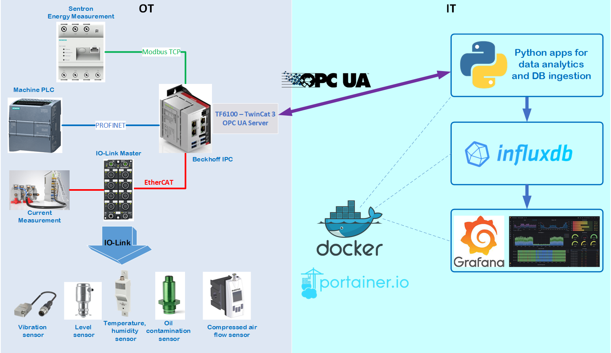

# IIoT Real-Time Analytics using OPC UA and Beckhoff IPC

IIoT project for data exchange between PLC in OT and IT area with usage of OPC UA protocol and data analytics.

## System Diagram



## General Overview
Using this framework it's possible to collect data from different sensors, PLCs and devices in OT area. 
The collected data are preprocessed in Beckhoff IPC, packed into `StructuredType` variable and exposed in OPC UA server into IT area.

In IT area, there are couple of containerized applications which run using Docker (Docker-Compose) and Portainer. 
Python apps (as opc ua clients) request data from Bechkoff IPC (as opc ua server) and perform analytics, anomaly detection in sensor signals and finally save the results in time series database InfluxDB. 
The graphical results are visible as dashboards in Grafana.

This repo includes exclusively code for PLC Beckhoff in TwinCat3. The software framework of IT area is placed in separated GitHub repo.

The TwinCat project includes simulation where simplified real-world industrial line with devices and components can generate data and publish it over MQTT  


## Preparing PLC variable for OPC UA.
Data which should be exposed on OPC UA server are prepared as `STRUCT` data type.
 
Below example of pragma declaration for humidity sensor: 
```
{attribute 'OPC.UA.DA' := '1'}                  // enable/disable to OPC UA
{attribute 'OPC.UA.DA.Access' := '1'}           // read only
{attribute 'OPC.UA.DA.StructuredType' := '1'}   // define variable as STRUCT for OPC UA
HumiditySensorStruct                            : SingleSensor_DataModel;
```

## OPC UA namespace and reference

OPC client needs node reference and namespace of variable which it should request.
These information is not directly available in TwinCat.
The exact `NodeId` can be determined by some OPC UA browser, below example from Prosys OPC UA client:

